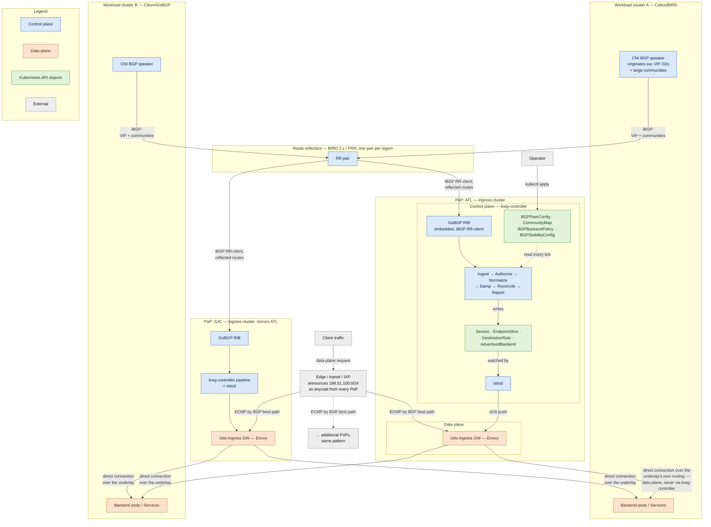

# KREG — Kubernetes Routable Edge Gateway

**Repo:** `github.com/phenixblue/kreg`
**Binary:** `kreg-controller` · **API group:** `kreg.twr.dev`, version `v1alpha1`

**One-line scope:** a control-plane translator that consumes BGP routing state
advertised by Kubernetes clusters and reconciles it into Istio + Gateway API
configuration. It generates config. It is never in the packet path.

---

## 1. Architecture

```
                             ┌─────────────────────────────────┐
      Internet               │  Edge / transit / IXP           │
         │                   │  announces 198.51.100.0/24      │
         │                   │  as anycast from every PoP      │
         ▼                   └─────────────────────────────────┘
   ECMP by BGP best path
         │
    ┌────┴──────────────────────────┐
    ▼                               ▼
  PoP: ATL                        PoP: SJC
┌───────────────────────┐       ┌───────────────────────┐
│ Ingress cluster       │       │ Ingress cluster       │
│                       │       │                       │
│  Istio ingress GW ◄───┼─ xDS  │  Istio ingress GW     │   DATA PLANE
│         ▲             │       │         ▲             │   (unmodified)
│      istiod           │       │      istiod           │
│         ▲ watches CRs │       │         ▲             │
│  ┌──────┴──────────┐  │       │  ┌──────┴──────────┐  │
│  │ kreg-controller  │  │       │  │ kreg-controller  │  │   CONTROL PLANE
│  │  · GoBGP RIB    │  │       │  │                 │  │   (this project)
│  │  · normalizer   │  │       │  │                 │  │
│  │  · damper       │  │       │  │                 │  │
│  │  · reconciler   │  │       │  └─────────────────┘  │
│  └──────▲──────────┘  │       │         ▲             │
└─────────┼─────────────┘       └─────────┼─────────────┘
          │  iBGP (route-reflector client)│
          ▼                               ▼
      ┌───────────────────────────────────────────┐
      │  Route reflectors  (BIRD 2.x / FRR)       │
      │  one pair per region                      │
      └───▲─────────────▲──────────────▲──────────┘
          │             │              │
   workload cluster  workload cl.  workload cl.
   A (Calico/BIRD)   B (Calico)    C (Cilium/GoBGP)
   advertises service VIP /32s + large communities
```

**Session scaling.** The controller peers with route reflectors, not with node
speakers. Sessions are O(clusters), not O(nodes). Without this, 40 clusters ×
50 nodes is 2,000 sessions per controller replica and the design dies at
about cluster number six.

**Prefix scoping.** The per-service `/32`s are internal to your AS. Only the
aggregate (a `/24` minimum for IPv4, `/48` for IPv6) is announced to transit.
This is what keeps you inside provider prefix limits and out of global-table
filters.

**Route origination: not KREG's job.** Workload clusters'
own CNI BGP speakers (Calico, Cilium, kube-router — see the diagram) originate
the per-service `/32`s; route reflectors reflect them; KREG only ever
*ingests*. The controller never announces a route of its own — not the
anycast aggregate, not a synthesized route based on Envoy/application health,
nothing. Two reasons, both load-bearing:

- It would put Kubernetes/application state in a position to directly
  influence the BGP control plane's reachability decisions across an entire
  anycast fabric, not just local config — precisely the boundary the one-line
  scope statement above draws ("generates config, never in the packet path").
  A health-check flap turning into a route flap is a fundamentally worse
  failure mode than a health-check flap turning into an xDS update, because
  the blast radius stops being one cluster's data plane and starts being
  every PoP's routing table.
- §4's failure semantics ("controller down → nothing breaks... you lose the
  ability to *change* routing, not the ability to *serve*") depend on KREG
  being strictly downstream of BGP reachability. An originating KREG would be
  upstream of it for whatever it originates, and that guarantee stops holding
  for those routes specifically.

If a future need genuinely requires KREG-originated routes (e.g. synthesizing
an aggregate from ingress-gateway health rather than trusting workload
clusters to always announce correctly), it's a new, explicitly-scoped
capability with its own failure-mode analysis — not an extension of ingest.

### Detailed topology

The ASCII sketch above is the one-glance version. This is the same system
end to end: every hop client traffic actually takes, every hop BGP control
state takes, and where the line between control plane and data plane
actually falls. ATL is drawn in full; SJC (and every PoP beyond it — this
pattern repeats per-region, that's the whole point of "Session scaling"
above) mirrors it exactly, collapsed here so the diagram stays readable.



Three things this makes explicit that the sketch above doesn't:

- **The data plane never touches kreg-controller.** Envoy's connection to a
  workload cluster's VIP is ordinary IP routing over the same underlay the
  BGP fabric maintains — real routers forward those packets. kreg-controller
  reads the control-plane state that fabric carries; it doesn't sit on the
  forwarding path for a single packet.
- **`AdvertisedBackend`/`Service`/`EndpointSlice`/`DestinationRule` are the
  entire interface between kreg-controller and istiod.** istiod never talks
  BGP, and kreg-controller never talks xDS — the Kubernetes API is the only
  coupling, which is what lets a second driver (Envoy Gateway, §7) or a
  second Gateway API implementation swap in without touching the BGP side at
  all.
- **Every PoP runs the full pipeline independently** — its own GoBGP RIB, its
  own `Ingest`→`Report` chain, its own `istiod`. §4's "split brain between
  PoPs is fine and expected" isn't a caveat bolted onto a shared system; it's
  what the topology already looks like.

### Pipeline stages

| Stage | Responsibility | Notes |
|---|---|---|
| **Ingest** | GoBGP embedded as a library; peers or acts as BMP collector | Expose the RIB behind an interface so tests don't need a daemon |
| **Authorize** | Drop routes not in the peer's `allowedPrefixes` | The security boundary. Runs before anything else |
| **Normalize** | Decode communities/MED/AS-path into a `BackendCandidate` | Pure function. RIB snapshot in, semantic model out |
| **Damp** | Hold-down, flap dampening, debounce | Prevents route churn from becoming xDS churn |
| **Reconcile** | Settled snapshot + policies → `Service`/`EndpointSlice` + driver-lowered policy CRs | controller-runtime, standard desired-state diff |
| **Report** | Write `AdvertisedBackend` status objects, metrics, events | The debuggability surface. Do not treat as optional |

---

## 2. CRD surface

Six kinds. Two are infra-role (cluster-scoped), one is a policy-attachment
object (namespaced), two are reusable cluster-scoped config singletons, one
is read-only status.

### 2.1 `BGPPeerConfig` — cluster-scoped, infra role

How the controller acquires routing state, and the trust boundary.

```yaml
apiVersion: kreg.twr.dev/v1alpha1
kind: BGPPeerConfig
metadata:
  name: atl-reflectors
spec:
  localASN: 4200000000          # 4-byte private; 2-byte range is too small
  routerID: 10.0.0.1
  listenPort: 179
  mode: RouteReflectorClient    # | Passive | BMPCollector

  peers:
    - name: rr-atl-a
      address: 10.0.10.1
      remoteASN: 4200000000     # iBGP to the RR
      auth:
        tcpMD5SecretRef: {name: rr-atl-md5, key: password}
      gracefulRestart:
        enabled: true
        staleRoutesTime: 120s
      timers: {hold: 90s, keepalive: 30s}

  # Trust boundary. A peer may only originate prefixes bound to it here.
  # Enforced in-controller, independent of any router-side prefix-list.
  clusterBindings:
    - clusterID: atl-1
      allowedPrefixes: ["198.51.100.0/26"]
      maxPrefixes: 256                    # excess from this cluster fails
                                           # closed; session unaffected
      locality: {region: us-east, zone: us-east-atl-a}
    - clusterID: atl-2
      allowedPrefixes: ["198.51.100.64/26"]
      maxPrefixes: 256
      locality: {region: us-east, zone: us-east-atl-b}

status:
  peers:
    - name: rr-atl-a
      sessionState: Established
      uptime: 14d3h
      prefixesReceived: 312
      prefixesAccepted: 298
      prefixesRejected: 14        # → see AdvertisedBackend for reasons
```

Attribution note: the origin cluster is identified by which
`clusterBindings` entry the prefix falls into, not by anything the peer
asserts. Through a route reflector, the advertising peer address is the RR,
so prefix→cluster is the only trustworthy binding you have. Design for that
from day one.

### 2.2 `CommunityMap` — cluster-scoped, reusable

The metadata channel. This is what makes the tool more than a route-to-YAML
converter: an operator drains a cluster with a route-map, no Kubernetes
access required.

```yaml
apiVersion: kreg.twr.dev/v1alpha1
kind: CommunityMap
metadata:
  name: default
spec:
  # Large communities: <globalAdmin>:<function>:<value>
  rules:
    - match: {largeCommunity: "4200000000:1:*"}
      set:   {field: weight, fromCommunityValue: true}      # 4200000000:1:80 → weight 80
    - match: {largeCommunity: "4200000000:2:1"}
      set:   {field: tier, value: canary}
    - match: {largeCommunity: "4200000000:3:1"}
      set:   {field: drain, value: "true"}                  # graceful, not withdrawal
    - match: {largeCommunity: "4200000000:4:*"}
      set:   {field: serviceTag, fromCommunityValue: true}  # links VIP → logical service

  # Fallbacks when no community is present
  fallbacks:
    weightFrom: MED                # lower MED → higher weight (inverted)
    preferenceFrom: ASPathLength
    defaultWeight: 100

  # Refuse to guess
  onUnmappedCommunity: Ignore      # | Reject | Warn
```

`drain` vs. withdrawal matters: draining should stop *new* connections while
letting in-flight ones finish. Withdrawal is a hard signal. Giving operators
both is worth the extra community.

**`serviceTag`: community, not prefix position.** The alternative was
encoding which logical service a VIP belongs to in the address structure
itself — carving reserved sub-ranges or octet positions out of the prefix
block per service, the way subnetting schemes encode meaning into address
layout. Rejected: it welds two things together that should stay independent.
Address assignment is IPAM's job; which service a VIP belongs to is a
grouping decision that changes over time (a service gets renamed, split, or
merged) — tying it to the address means a tag change means a renumber, and
adding a second tagging dimension later means redesigning the carving scheme
from scratch. It also means operators need a second mental model just for
this one field, when `weight`/`tier`/`drain` already prove the community
mechanism handles arbitrary route metadata without spending address space —
`serviceTag` is just one more `CommunityMap` rule, decoded identically,
drained identically, no separate tooling. BGP communities exist precisely so
you don't have to encode metadata into addressing; using them here is using
the tool for what it's for, not the exception.

### 2.3 `BGPBackendPolicy` — namespaced, policy attachment

The DNSPolicy analogue. Targets a `Gateway` or `HTTPRoute` via
`targetRef`, following the Gateway API policy-attachment convention.

```yaml
apiVersion: kreg.twr.dev/v1alpha1
kind: BGPBackendPolicy
metadata:
  name: prod-web
  namespace: gateways
spec:
  targetRef:
    group: gateway.networking.k8s.io
    kind: Gateway                   # or HTTPRoute for per-route override
    name: prod-web

  # Which advertised routes feed this target
  selector:
    prefixes: ["198.51.100.0/24"]
    serviceTag: 80                  # from CommunityMap rule 4
    clusterIDs: []                  # empty = all authorized clusters

  backend:
    port: 8443
    appProtocol: https
    tls:
      mode: SIMPLE                  # SIMPLE (v1 default) | Passthrough | Mutual
      sni: prod-web.internal
      credentialRef: {name: upstream-ca}   # CA bundle; unused in Passthrough mode

  loadBalancing:
    strategy: Locality              # | Weighted | Uniform
    locality:
      preference: [us-east, us-west, eu-west]
      failoverThreshold: 50         # % of local capacity healthy before spilling

  # BGP is reachability, not application health. Both are required.
  activeHealth:
    path: /healthz
    interval: 5s
    timeout: 2s
    unhealthyThreshold: 3
    healthyThreshold: 2
  outlierDetection:
    consecutive5xx: 5
    baseEjectionTime: 30s
    maxEjectionPercent: 50

status:
  conditions: [{type: Accepted, status: "True"}, {type: Programmed, status: "True"}]
  activeBackends: 6
  suppressedBackends: 1
  generated:
    - Service/gateways/prod-web-kreg
    - DestinationRule/gateways/prod-web-kreg
```

**`backend.tls.mode` roadmap.** Three modes, shipped in order of how much
trust each one asks the gateway to hold, not built together: each is a
strictly bigger PKI/architecture commitment than the last, and there's no
deployment that needs `Mutual` without first having proven out `SIMPLE`.
`SIMPLE` is the v1 default: the reconciler attaches a `BackendTLSPolicy`
validating the backend's server cert against `credentialRef`, no client cert
asserted. `Passthrough` is the fast-follow — the reconciler emits a
`TLSRoute` (SNI-routed, un-terminated) instead of `HTTPRoute` + `Service`, so
the gateway never holds key material for that backend at all; the tradeoff
is losing HTTP-level routing and `outlierDetection.consecutive5xx` for that
policy, so it's opt-in per `BGPBackendPolicy`, not a global switch. `Mutual`
— the gateway also asserts a client cert, verified by the backend — is
deferred until a real regulatory-boundary deployment justifies the added
PKI.

### 2.4 `BGPStabilityConfig` — cluster-scoped, reusable

How route churn is smoothed before it reaches generated Gateway API /
Istio config: hold-down, addition debounce, and flap dampening. Singular
and cluster-scoped, same convention as `CommunityMap`, rather than
attached per-`BGPBackendPolicy`: a backend's hold-down and dampening
state (`AdvertisedBackend.status`) is one value per prefix+clusterID,
independent of which policy or policies currently select it, so there's
no principled per-policy owner for this config.

```yaml
apiVersion: kreg.twr.dev/v1alpha1
kind: BGPStabilityConfig
metadata:
  name: default
spec:
  withdrawalGrace: 30s            # hold-down before removing a backend
  additionDelay: 10s              # don't act on a route until it's settled
  dampening:
    enabled: true
    halfLife: 90s
    suppressThreshold: 3000       # instability score that triggers suppression
    reuseThreshold: 750           # score it must decay back below to reuse
    maxSuppress: 30m              # hard cap regardless of score
```

**Algorithm choice: EWMA, not classic RFC 2439 penalty decay.** Four shapes
were on the table:

- **RFC 2439-style penalty decay** — the field names above (`halfLife`,
  `suppressThreshold`, `reuseThreshold`, `maxSuppress`) are its vocabulary,
  and it's the obvious default for anything calling itself "BGP flap
  dampening." The problem: classic flap damping earned a real bad
  reputation in production networks, and RFC 7196 (2014) recommends against
  enabling it on eBGP sessions at all — path-hunting during a single
  upstream event can look like many flaps to a downstream observer,
  over-penalizing routes that were never actually unstable and turning a
  transient event into extended suppression. The mitigating factor here is
  that KREG dampens at one RR-facing edge inside a single org's iBGP, not
  across ASes, so the path-hunting amplification that made this toxic on the
  internet mostly doesn't apply — but it's still borrowing a discredited
  algorithm's math, and worth being honest that the reputation comes
  attached.
- **Fixed/sliding-window counter** — count transitions in a trailing window,
  dampen past N. Trivial to explain and debug ("flapped 6 times in the last
  hour" needs no unit conversion), but a fixed window has a hard edge: a
  route that flapped 3 times 23h59m ago instantly looks healthy the moment
  the window rolls, with nothing having actually changed.
- **Debounce/hysteresis state machine** — require N consecutive transitions
  to enter `Dampened`, M consecutive stable ticks to leave it. Simplest to
  implement correctly, and the *only* one of the four with built-in
  protection against the dampener oscillating itself — but the least
  principled: N and M are arbitrary knobs with no decay curve behind them,
  tuned by trial and error rather than derived from a model.
- **EWMA (chosen)** — same recency-weighted decay behavior as RFC 2439
  penalty math, but evaluated once per Damp tick and decayed against the
  real elapsed time since the last tick rather than an assumed fixed
  interval, so it rides the reconciler's existing poll cadence instead of
  needing its own continuous clock. Keeps the recency-weighting property
  that makes penalty decay worth having in the first place, without
  carrying quite as much of classic flap damping's specific baggage.

`AdvertisedBackend.status.stability` shipping both `flapCount24h` (a simple
count, for at-a-glance debugging) and `dampeningPenalty` (the decaying score
that actually drives suppression) reflects this directly: report the count
because it's what a human reads first, drive behavior off the decayed score
because that's the part with real recency-weighting.

The algorithm itself — bumped on each flap and decayed against real
elapsed time — sits behind an internal interface (`internal/damp.Damper`),
not a user-selectable field here: `halfLife`/`suppressThreshold`/
`reuseThreshold`/`maxSuppress` describe its tunable behavior, not its
implementation, so a second algorithm can replace the first without an API
change. A cluster with no `BGPStabilityConfig` yet is a valid, unremarkable
state: hold-down grace and addition delay default to none, dampening
defaults to disabled — the same behavior as before the Damper existed.

### 2.5 `AdvertisedBackend` — cluster-scoped, controller-written, read-only

The materialized view of the RIB. This exists so that "why isn't traffic
going to atl-2" is answerable with `kubectl get advertisedbackends` instead
of `birdc show route` on a box the app team can't reach. Treat it as a
first-class product feature, not telemetry.

```yaml
apiVersion: kreg.twr.dev/v1alpha1
kind: AdvertisedBackend
metadata:
  name: 198-51-100-10-32-atl-1
status:
  prefix: 198.51.100.10/32
  clusterID: atl-1
  peer: rr-atl-a
  locality: {region: us-east, zone: us-east-atl-a}

  attributes:
    weight: 80
    tier: stable
    drain: false
    serviceTag: 80
    med: 100
    asPath: [4200000101]
    largeCommunities: ["4200000000:1:80", "4200000000:4:80"]

  state: Active         # Active | HoldDown | Draining | Dampened | Pending | Rejected
  reason: ""            # e.g. "prefix 203.0.113.5/32 not in allowedPrefixes for atl-1"
  firstSeen: "2026-08-01T09:14:22Z"
  lastChange: "2026-08-04T02:11:07Z"

  # The Damper's own bookkeeping, grouped so the full hold-down/flap/
  # suppression picture reads at a glance. withdrawnAt, suppressedSince,
  # and pendingSince are only set while this backend is actually in that
  # condition — nil here, since it's currently Active.
  stability:
    flapCount24h: 2
    dampeningPenalty: 340
    lastObservedAt: "2026-08-04T02:11:07Z"

  boundPolicies: ["gateways/prod-web"]
  generatedResources: ["EndpointSlice/gateways/prod-web-kreg-atl-1"]
```

### 2.6 `BGPGatewayClassConfig` — optional, cluster-scoped

Defaults so every `BGPBackendPolicy` doesn't restate the same
`activeHealth`/`outlierDetection` blocks. Merge semantics: policy overrides
class, class overrides built-in defaults. `stability` isn't part of this —
it's a single cluster-wide `BGPStabilityConfig` (§2.4), not per-policy or
per-class.

---

## 3. What the reconciler writes

Backend identity — "here is a `Service`, here are its addresses" — is
portable Kubernetes, not an Istio extension. A headless `Service` (no
selector) plus hand-written `EndpointSlice`s resolves through
`HTTPRoute.backendRefs` on any conformant Gateway API implementation, because
that resolution path is core service networking, not a vendor hook. That's
the seam this design hangs on, in place of an implementation-specific one.

Traffic policy — locality-weighted LB, outlier detection, backend TLS — isn't
standardized across implementations yet. That half goes through a small
**backend driver** inside the reconciler: `BGPBackendPolicy` (§2.3) is the
vendor-neutral input, and a driver lowers it into whatever the target Gateway
implementation understands. v1 ships one driver, Istio, per the build-order
reasoning in §7 — one good integration before a second is attempted. The
driver boundary exists so a second driver (Envoy Gateway, targeting its
`BackendTrafficPolicy`) is additive later, not a redesign.

**Generated — headless `Service`:**

```yaml
apiVersion: v1
kind: Service
metadata:
  name: prod-web-kreg
  namespace: gateways
  labels: {kreg.twr.dev/managed-by: prod-web}
spec:
  clusterIP: None
  ports:
    - {name: https, port: 8443, protocol: TCP}
```

**Generated — one `EndpointSlice` per active advertised VIP:**

```yaml
apiVersion: discovery.k8s.io/v1
kind: EndpointSlice
metadata:
  name: prod-web-kreg-atl-1
  namespace: gateways
  labels:
    kubernetes.io/service-name: prod-web-kreg
    kreg.twr.dev/managed-by: prod-web
addressType: IPv4
ports:
  - {name: https, port: 8443, protocol: TCP}
endpoints:
  - addresses: ["198.51.100.10"]      # the /32 learned via BGP
    conditions: {ready: true}
    zone: us-east-atl-a               # decoded locality
    hints: {forZones: [{name: us-east-atl-a}]}
```

`weight` from the large community isn't expressible on a core `EndpointSlice`
endpoint — that's exactly the kind of thing that goes through the driver as
part of a `BGPBackendPolicy`-attached traffic-weighting policy instead.

**Generated by the Istio driver — `DestinationRule`:**

```yaml
apiVersion: networking.istio.io/v1
kind: DestinationRule
metadata: {name: prod-web-kreg, namespace: gateways}
spec:
  host: prod-web-kreg.gateways.svc.cluster.local
  trafficPolicy:
    loadBalancer:
      localityLbSetting:
        enabled: true
        failover:
          - {from: us-east, to: us-west}
          - {from: us-west, to: us-east}
    outlierDetection:
      consecutive5xxErrors: 5
      baseEjectionTime: 30s
      maxEjectionPercent: 50
    tls: {mode: SIMPLE, sni: prod-web.internal}
```

An Envoy Gateway driver would lower the same `BGPBackendPolicy` into a
`BackendTrafficPolicy`/`ClientTrafficPolicy` targeting the same `Service`.
Backend TLS specifically may not even need a driver-specific object: Gateway
API's standard-channel `BackendTLSPolicy` is implementation-neutral and both
Istio and Envoy Gateway honor it.

**Written by the human, unchanged by the controller — `HTTPRoute`:**

```yaml
apiVersion: gateway.networking.k8s.io/v1
kind: HTTPRoute
metadata: {name: prod-web, namespace: gateways}
spec:
  parentRefs: [{name: prod-web}]
  hostnames: ["www.example.com"]
  rules:
    - backendRefs:
        - name: prod-web-kreg
          port: 8443
```

App teams keep authoring plain `HTTPRoute`s against a plain `Service` — no
KREG-specific hostname, no implementation-specific `kind`/`group` override.
The BGP layer is entirely invisible to them, which is the whole point, and
now so is the choice of Gateway implementation.

**Rules for the reconciler:** own resources by label
(`kreg.twr.dev/managed-by`), never patch resources you don't own, never emit
`EnvoyFilter`, and always reconcile from a full RIB snapshot rather than an
update stream. BGP is soft state; Gateway API is desired state. Bridging
those with deltas will produce drift you cannot debug.

---

## 4. Failure semantics

State these loudly in the README; they're the reason anyone will trust it in
the path of production traffic.

- **Controller down → nothing breaks.** Envoy keeps last-known-good config.
  Anycast and ECMP keep steering. You lose the ability to *change* routing,
  not the ability to *serve*.
- **BGP session down → hold-down, not immediate withdrawal.** Graceful
  restart plus `withdrawalGrace` means a controller restart or an RR blip
  doesn't drain a healthy cluster.
- **istiod down → same.** Envoy holds config.
- **Split brain between PoPs is fine and expected.** Each PoP's controller
  makes local decisions from local BGP state. There is no cross-PoP consensus
  and there should not be.

**HA:** 2–3 replicas. *All* replicas maintain BGP sessions and a warm RIB;
only the leader writes Kubernetes resources. Leader election on the write
side alone means failover is instant instead of waiting for BGP
reconvergence.

---

## 5. Local development footprint

Three tiers. Most days you should be in Tier 0.

### Tier 0 — no network, no cluster (80% of the dev loop)

- RIB behind a Go interface; table-driven tests feed synthetic route updates.
- `envtest` for the API server; assert on generated manifests as golden files.
- Property tests on the normalizer: it's a pure function, so fuzz it.
- Runs natively on macOS. Sub-second feedback. No Docker.

**This is the single most important design decision for velocity.** If
testing the reconciler requires a BGP daemon, development will be slow enough
that the project stalls.

### Tier 1 — one kind cluster + synthetic speakers (~4 GB)

```
kind cluster (hub)
├── istio (gatewayclass: istio)
├── kreg-controller
└── Gateway + HTTPRoute fixtures

docker network (same as kind)
├── exabgp-cluster-a  ← replays advertisements from a JSON script
├── exabgp-cluster-b
└── exabgp-cluster-c
```

ExaBGP is the right choice here specifically because its config *is* a
script: you can drive flaps, community changes, and withdrawals from a shell
loop. Validates real BGP wire parsing and real Istio config acceptance
without the cost of real clusters. This is your CI target.

### Tier 2 — full topology (~10–12 GB)

```
containerlab
├── frr-edge          (upstream, ECMP toward both PoPs)
├── frr-rr-a/rr-b     (route reflectors)
└── links into kind node netns

kind × 3
├── hub     — istio + kreg-controller
├── spoke-a — calico (BIRD) advertising service VIPs
└── spoke-b — cilium (GoBGP) advertising service VIPs
```

Exercises the real thing: Calico's BIRD originating `/32`s, RR reflection,
ECMP on the edge, controller reacting, Envoy reprogramming.

**macOS caveat:** containerlab really wants Linux netns and won't behave
under Docker Desktop. Run Tier 2 in a Lima or UTM VM, or on a cheap cloud
box — a Vultr or Hetzner instance with 16 GB is a few dollars a month and
will be far less painful than fighting the Mac networking stack. Tiers 0 and
1 stay local.

---

## 6. Production footprint

### Topology A — gateway in the workload cluster (start here)

Controller and Istio ingress run *in* each workload cluster. Each cluster
advertises its own VIPs; the edge ECMPs the anycast prefix across clusters.
Simplest thing that works. The controller is doing locality-aware failover
across clusters, not cross-PoP steering.

### Topology B — dedicated ingress PoPs (what you described)

Ingress clusters are separate from workload clusters, in 2+ PoPs. Workload
clusters push their reachability up via BGP and hold no ingress
responsibility. This is the version with the real differentiator: **the
ingress tier never holds kubeconfig for any workload cluster.** Clusters
assert; the hub doesn't pull. For an org where clusters cross team or
regulatory boundaries, that inversion is the entire sales pitch.

### Sizing

| Component | Per PoP | Notes |
|---|---|---|
| Ingress cluster control plane | 3 nodes, 4 vCPU / 8 GB | Standard HA |
| Istio ingress gateway pods | 4–8 × (4 vCPU / 4 GB) | ~2–4 Gbps each with TLS; HPA on active connections |
| `kreg-controller` | 2 × (500m / 512 Mi) | It's a config generator. Tiny |
| Route reflectors | 2 × (2 vCPU / 4 GB) | BIRD or FRR. Keep off Kubernetes |
| istiod | 2 × (2 vCPU / 4 GB) | Scales with config size, not traffic |

### Numbers plan

- **ASNs:** 4-byte private range (4200000000–4294967294). The 2-byte private
  range gives you ~1,000 usable and you will regret it. Public ASN only at
  the edge.
- **Prefixes:** one `/24` (IPv4) and `/48` (IPv6) minimum for the anycast
  announcement — anything longer gets filtered from the global table.
  Per-service `/32`s stay internal.
- **Scale ceiling:** 50 clusters × 500 VIPs = 25k prefixes. Nothing for BGP.
  Your ceiling is xDS push size and istiod config churn, not routing.

### Provider notes

If you don't already have a colo footprint, this shapes your v1 hosting:

- **Vultr** is the pragmatic starting point. They support BGP either with
  your own RIR-registered space and ASN, *or* with prefixes Vultr allocates
  to you — which means you can build and demo real anycast without an RIR
  application. Prefixes can be advertised from multiple sites for anycast,
  and there's no additional charge for BGP.
- **Equinix Metal** supports BYOIP with Global BGP but requires a public ASN
  and RIR-registered space with matching IRR route objects, and enforces a
  10-prefix-per-neighbor limit. That limit is another reason per-service
  `/32`s must stay inside your AS. Their routers also don't export routes
  back to you.
- **DigitalOcean** — worth confirming, but I don't believe they offer
  customer BGP sessions, so it likely can't host the anycast layer even if
  you use it elsewhere.
- **RPKI ROAs** for any prefix you originate, from day one. Not optional in
  2026.

---

## 7. Build order

1. **Normalizer + reconciler, no BGP.** Feed a hand-written route table
   struct, emit `Service`/`EndpointSlice` plus the Istio driver's
   `DestinationRule`. Golden-file tests. Proves the output model is correct
   before any networking exists, and proves the driver boundary is real by
   having exactly one thing on each side of it.
2. **GoBGP ingest behind the interface.** Tier 1 rig with ExaBGP speakers.
3. **`CommunityMap` + `AdvertisedBackend`.** The differentiators. Ship the
   debuggability surface early — it's what makes demos land.
4. **Damper.** Only meaningful once you have real flapping to observe.
5. **`BGPPeerConfig` authorization + session management.** Security-critical,
   so do it deliberately rather than as an afterthought.
6. **Tier 2 validation, then a real two-PoP deployment on Vultr.**
7. **Envoy Gateway driver**, once the Istio driver has real production
   mileage — implements the same `BGPBackendPolicy` lowering against
   `BackendTrafficPolicy`/`ClientTrafficPolicy` instead of `DestinationRule`.
   Not v1.
8. **`backend.tls.mode: Passthrough`**, once `SIMPLE` has real usage —
   `TLSRoute` output path for backends that want zero shared cert material
   with the ingress tier. **`Mutual`** comes later still, once a deployment's
   trust-boundary requirements actually demand it.

## 8. Open questions worth deciding early

None currently open. The decisions above (API group, backend identity vs.
traffic policy, `serviceTag`, route origination, backend TLS roadmap)
reflect what's chosen; revisit this section as implementation surfaces new
tradeoffs.
